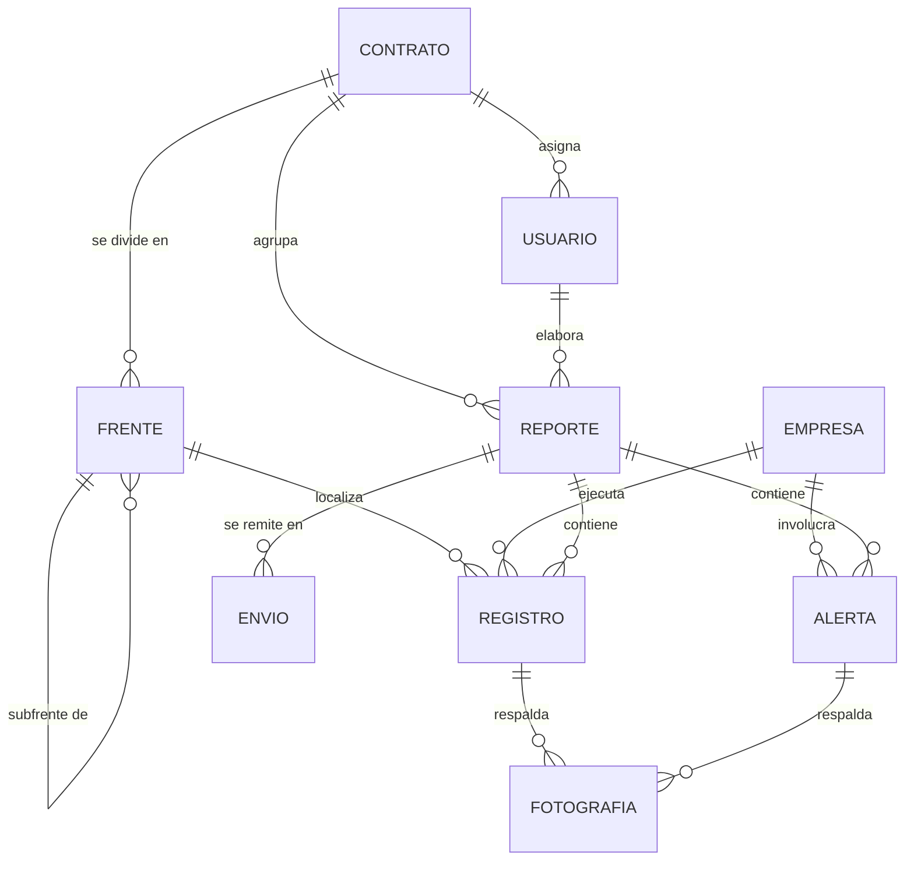

# Estructura de datos preliminar

**Proyecto:** Bitácora - ITO
**Fecha:** 30 de septiembre de 2026
**Base:** Reporte Diario de Inspección de Construcción, código de proyecto 4600026893-8211-FRMCS-00001, revisión 1. Ejemplares del 24 y 27 de septiembre de 2026, turno día.
**Estado:** preliminar. Se ajustará a medida que avance el desarrollo.

---

## 1. Criterio de diseño

El modelo se construyó **desde el reporte hacia el terreno**: se tomó el formato que hoy recibe el mandante y se definió dónde se captura cada dato durante la jornada. La regla es que **todo campo que aparece en el reporte debe tener origen en la captura de terreno o en la configuración del contrato**; si un dato no tiene origen, o falta capturarlo, o sobra en el reporte.

Una segunda regla, acordada con el equipo: **el modelo guarda lo que el reporte informa, y nada más**. El reporte es la constancia de un turno, no un sistema de seguimiento; por eso no existen estados de avance, cierres ni plazos.

## 2. Entidades

| Entidad | Qué representa |
|---|---|
| `usuario` | Inspector de terreno, jefatura de inspección o administrador |
| `contrato` | Servicio de inspección con su mandante, su formato de reporte y sus destinatarios |
| `empresa` | Contratista o laboratorio que ejecuta trabajos en la obra (TECNASIC, GEOINYECTA, IDIEM, OOCC) |
| `frente` | Frente y subfrente, jerárquico y numerado (1.0 Muro Sotelo → 1.2 Excavación y rellenos ZCF). Lo escribe el inspector y queda disponible para los reportes siguientes |
| `reporte` | Reporte diario de un contrato, una fecha y un turno |
| `registro` | Actividad observada en un subfrente, o su declaración de «sin actividad» |
| `alerta` | Hecho que se publica en la tabla de alertas del reporte |
| `fotografia` | Imagen asociada a un registro o a una alerta |
| `envio` | Remisión del reporte al mandante |

## 3. Relaciones

En palabras:

- Un **contrato** acumula sus **frentes** (que se anidan en subfrentes) y tiene sus inspectores asignados. Los frentes no se configuran al inicio: el inspector los escribe cuando aparecen en la obra y el sistema los recuerda para proponerlos en los reportes siguientes.
- Un **reporte** corresponde a un contrato, una fecha y un turno, y lo elabora **un** inspector.
- Un **registro** pertenece a un reporte, se ubica en un subfrente y corresponde a la empresa que ejecuta el trabajo.
- Una **alerta** pertenece a un reporte y se publica en una de las cuatro columnas del formato: Construcción, Laboratorio, Topografía o Interferencia.
- Las **fotografías** cuelgan del registro o de la alerta, lo que permite agruparlas por frente en el anexo.

## 4. Diccionario de campos

### 4.1 `usuario`

| Campo | Tipo | Obligatorio | Ejemplo |
|---|---|---|---|
| `id` | uuid | Sí | `9c1e…` |
| `nombre` | texto | Sí | `Jorge Orellana S.` |
| `correo` | texto | Sí | `jorellana@empresa.cl` |
| `rol` | enum (`inspector`, `jefatura`, `admin`) | Sí | `inspector` |
| `activo` | booleano | Sí | `true` |

### 4.2 `contrato`

| Campo | Tipo | Obligatorio | Ejemplo |
|---|---|---|---|
| `id` | uuid | Sí | `4f77…` |
| `nombre` | texto | Sí | `Servicio de ITO y Apoyo a la Construcción de Carén` |
| `mandante` | texto | Sí | `<mandante>` |
| `codigo_proyecto` | texto | Sí | `4600026893-8211-FRMCS-00001` |
| `codigo_interno` | texto | No | `JEJ-664-CT-INF-002` |
| `revision_formato` | texto | Sí | `1` |
| `prefijo_correlativo` | texto | Sí | `4600026893-8211-INDCS-` |
| `ultimo_correlativo` | entero | Sí | `1972` |
| `destinatarios` | lista de texto | Sí | `["inspeccion@mandante.cl"]` |
| `hora_cierre_turno_dia` | hora | No | `19:00` |

> `prefijo_correlativo` y `ultimo_correlativo` son lo que permite que el sistema asigne el número del reporte sin intervención manual. La serie es una sola y corre de forma continua: el reporte del turno día toma un número y el del turno noche toma el siguiente.

### 4.3 `empresa`

| Campo | Tipo | Obligatorio | Ejemplo |
|---|---|---|---|
| `id` | uuid | Sí | `c330…` |
| `contrato_id` | uuid (FK) | Sí | `4f77…` |
| `nombre` | texto | Sí | `TECNASIC` |
| `tipo` | enum (`contratista`, `laboratorio`, `topografia`, `otro`) | Sí | `contratista` |

### 4.4 `frente`

| Campo | Tipo | Obligatorio | Ejemplo |
|---|---|---|---|
| `id` | uuid | Sí | `a012…` |
| `contrato_id` | uuid (FK) | Sí | `4f77…` |
| `frente_padre_id` | uuid (FK) | No | `a011…` (vacío si es frente de primer nivel) |
| `numero` | texto | Sí | `1.2` |
| `nombre` | texto | Sí | `Excavación y rellenos de 1A zanja cortafuga` |
| `empresa_id` | uuid (FK) | No | `c330…` |
| `orden` | entero | Sí | `12` |
| `creado_por` | uuid (FK) | Sí | `9c1e…` |
| `creado_en` | timestamp | Sí | `2026-09-12T09:40:00-03:00` |
| `ultimo_uso` | fecha | No | `2026-09-27` |
| `vigente` | booleano | Sí | `true` |

> `frente_padre_id` reproduce la jerarquía del reporte: 1.0 Muro Sotelo contiene 1.1, 1.2 y 1.3. `orden` fija la secuencia en que se imprimen las secciones.
>
> El catálogo de frentes **lo construye el inspector**, no la jefatura: cuando aparece un frente nuevo en la obra, lo escribe con su número y nombre y queda guardado para el contrato. `ultimo_uso` permite proponer primero los frentes del reporte anterior, y `vigente` deja de ofrecer los que ya terminaron sin borrar los reportes donde aparecen.

### 4.5 `reporte`

| Campo | Tipo | Obligatorio | Ejemplo |
|---|---|---|---|
| `id` | uuid | Sí | `7bd3…` |
| `contrato_id` | uuid (FK) | Sí | `4f77…` |
| `fecha` | fecha | Sí | `2026-09-27` |
| `turno` | enum (`dia`, `noche`) | Sí | `dia` |
| `correlativo` | texto | Sí | `4600026893-8211-INDCS-01972` |
| `elaborado_por` | uuid (FK) | Sí | `9c1e…` |
| `clima_turno` | enum (`despejado`, `nublado`, `lluvia`) | Sí | `despejado` |
| `clima_proyeccion` | enum (`despejado`, `nublado`, `lluvia`) | Sí | `despejado` |
| `estado` | enum (`borrador`, `generado`, `aprobado`, `enviado`) | Sí | `enviado` |
| `hora_generacion` | timestamp | No | `2026-09-27T17:52:00-03:00` |
| `hora_aprobacion` | timestamp | No | `2026-09-27T17:56:00-03:00` |
| `aprobado_por` | uuid (FK) | No | `9c1e…` |
| `url_pdf` | texto | No | `https://…/reporte_2026-09-27.pdf` |
| `resumen_turno` | texto largo | No | `Turno sin novedades críticas. Se ejecutó avance en Muro Sotelo.` |

> El reporte lo elabora y emite **un** inspector, cuyo nombre queda en el campo «Elaborado por». Hay un reporte por turno: el del turno día y el del turno noche, cada uno a cargo de un inspector distinto.

### 4.6 `registro`

| Campo | Tipo | Obligatorio | Ejemplo |
|---|---|---|---|
| `id` | uuid | Sí | `e5a9…` |
| `reporte_id` | uuid (FK) | Sí | `7bd3…` |
| `frente_id` | uuid (FK) | Sí | `a012…` |
| `empresa_id` | uuid (FK) | No | `c330…` |
| `sin_actividad` | booleano | Sí | `false` |
| `descripcion` | texto largo | Sí (si `sin_actividad` es falso) | `Se realiza extendido y compactación de material 1A, 5.ª capa 30 cm…` |
| `origen_descripcion` | enum (`dictado`, `escrito`) | Sí | `dictado` |
| `latitud` | decimal | No | `-22.451200` |
| `longitud` | decimal | No | `-68.923100` |
| `registrado_en` | timestamp | Sí | `2026-09-27T10:24:00-03:00` |
| `sincronizado_en` | timestamp | No | `2026-09-27T12:05:00-03:00` |

> Los datos técnicos (Pk, cota, capa, cantidad, liberaciones de calidad, topografía y laboratorio) van **dentro de la descripción**, tal como se redactan hoy: el inspector dicta la actividad completa y no llena campos adicionales en terreno. `registrado_en` y `sincronizado_en` separadas permiten demostrar que la observación se levantó en terreno aunque no hubiera señal.

### 4.7 `alerta`

| Campo | Tipo | Obligatorio | Ejemplo |
|---|---|---|---|
| `id` | uuid | Sí | `b7c1…` |
| `reporte_id` | uuid (FK) | Sí | `7bd3…` |
| `columna` | enum (`construccion`, `laboratorio`, `topografia`, `interferencia`) | Sí | `construccion` |
| `empresa_id` | uuid (FK) | No | `c330…` |
| `frente_id` | uuid (FK) | No | `a012…` |
| `descripcion` | texto largo | Sí | `En zanja de anclaje ZCF los rellenos de las últimas 2 capas no presentan la misma consistencia…` |
| `criticidad` | enum (`baja`, `media`, `alta`) | Sí | `media` |
| `registrado_en` | timestamp | Sí | `2026-09-27T14:10:00-03:00` |

> La observación que detecta el inspector se publica aquí, en la tabla de alertas, con la criticidad que él mismo indica en escala baja, media o alta. La criticidad es el único campo que el formato actual no contempla. La alerta pertenece al reporte del día y **no se arrastra ni se cierra**: si la situación persiste, el inspector la vuelve a reportar.

### 4.8 `fotografia`

| Campo | Tipo | Obligatorio | Ejemplo |
|---|---|---|---|
| `id` | uuid | Sí | `11c4…` |
| `registro_id` | uuid (FK) | No | `e5a9…` |
| `alerta_id` | uuid (FK) | No | `b7c1…` |
| `url` | texto | Sí | `https://…/f-01972-01.jpg` |
| `orden` | entero | Sí | `1` |
| `pie_foto` | texto | No | `Muro Sotelo, extendido capa 17` |
| `capturada_en` | timestamp | Sí | `2026-09-27T10:22:00-03:00` |
| `latitud` | decimal | No | `-22.451200` |
| `longitud` | decimal | No | `-68.923100` |

> Toda fotografía cuelga de un registro o de una alerta, nunca de ambos ni de ninguno. El anexo fotográfico se arma siguiendo el `orden` del frente al que pertenece el registro.

### 4.9 `envio`

| Campo | Tipo | Obligatorio | Ejemplo |
|---|---|---|---|
| `id` | uuid | Sí | `d7f0…` |
| `reporte_id` | uuid (FK) | Sí | `7bd3…` |
| `enviado_por` | uuid (FK) | Sí | `9c1e…` |
| `destinatarios` | lista de texto | Sí | `["inspeccion@mandante.cl"]` |
| `enviado_en` | timestamp | Sí | `2026-09-27T17:58:00-03:00` |
| `estado` | enum (`enviado`, `fallido`, `reintentando`) | Sí | `enviado` |
| `acuse_recibido` | booleano | No | `true` |

## 5. Reglas de negocio

1. Existe **un solo reporte por contrato, fecha y turno**, y cada turno lo elabora un inspector distinto. Al registrar la primera actividad, el reporte se crea en estado `borrador` y toma el correlativo siguiente de la serie del contrato, que es única y continua para ambos turnos.
2. Un frente **sin registros al cierre del turno** obliga al inspector a confirmar «sin actividad»: el reporte no se genera con frentes en blanco.
3. El inspector puede **crear, renumerar o dar de baja** un frente en cualquier momento; el cambio rige desde el reporte en curso y no altera los reportes ya emitidos.
4. Una alerta de criticidad `alta` **exige al menos una fotografía**.
5. Un reporte solo pasa a `enviado` después de `aprobado`: **la aprobación humana es obligatoria** y queda registrada con autor y hora.
6. Los registros capturados sin señal conservan su `registrado_en` original al sincronizar.
7. Un reporte enviado **no se edita**: una corrección genera un nuevo `envio` sobre el mismo reporte, con trazabilidad de ambos.
8. Cada reporte es **independiente**: las alertas pertenecen al día en que se levantaron y no se heredan ni se cierran en reportes posteriores.

## 6. Cómo se mide la propuesta de solución con este modelo

| Indicador | Cálculo |
|---|---|
| Tiempo de elaboración del reporte | `envio.enviado_en` − `MIN(registro.registrado_en)` del turno |
| Reportes enviados dentro del turno | `envio.enviado_en` ≤ `contrato.hora_cierre_turno_dia` |
| Minutos de edición del borrador | `reporte.hora_aprobacion` − `reporte.hora_generacion` |
| Registros levantados en terreno | Proporción con `latitud` presente y `registrado_en` dentro del turno |

## 7. Decisiones pendientes

- Definir la compresión y el peso máximo por fotografía, según la conectividad disponible en faena.

## 8. Cómo se construyó este modelo

El modelo se elaboró en dos etapas. La primera partió de los Avances 1 y 2 del proyecto, es decir, de la descripción del problema y del caso de uso principal. La segunda contrastó ese primer modelo con dos reportes diarios reales del contrato, del 24 y del 27 de septiembre de 2026, y obligó a rehacerlo.

Los cambios que introdujo esa segunda etapa:

| Cambio | Motivo |
|---|---|
| Se eliminó todo el seguimiento de alertas: estado, cierre, responsable, plazo y arrastre entre reportes | El reporte deja constancia de un turno y no controla si lo observado se corrigió |
| Los datos técnicos (Pk, cota, capa, cantidad) y las liberaciones quedaron dentro del texto, sin campos separados | Es como se redactan hoy, y separarlos habría cargado al inspector en terreno sin beneficio |
| `hallazgo` se dividió en `registro` y `alerta` | En el reporte son dos bloques distintos: el cuerpo de actividades por frente y la tabla de alertas |
| `area` pasó a ser `frente`, con jerarquía de frente y subfrente | El reporte se estructura en frentes numerados y sus subfrentes, no en áreas planas |
| `proyecto` pasó a `contrato`, con códigos, revisión y serie de correlativos | El formato real los exige en el encabezado, y el correlativo se automatiza |
| `informe` pasó a `reporte`, asociado al contrato, la fecha y el turno | Así se identifica en el formato real, y lleva el nombre de quien lo elabora |
| El catálogo de frentes lo construye el inspector y no la jefatura | Los frentes cambian con el avance de la obra y es el inspector quien los escribe |
| Se agregó la entidad `empresa` | Las actividades y las alertas se atribuyen a la empresa que ejecuta |
| Se agregó `sin_actividad` | El reporte declara de forma explícita los frentes detenidos |
| Se agregaron el clima del turno y la proyección del día siguiente | Están en el encabezado del formato real y la primera versión los había omitido |
| Se separaron `registrado_en` y `sincronizado_en` | Permiten distinguir un registro levantado en terreno de uno reconstruido en gabinete |
| La criticidad se trasladó del registro a la alerta | Es en la tabla de alertas donde el inspector la indica |

